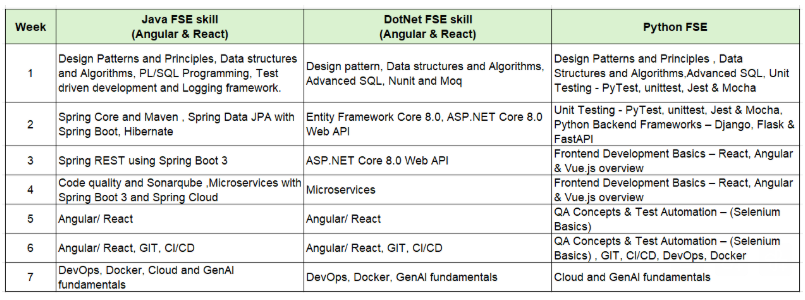

# Training Progress

**Name:** Yadlapalli Sai AbhiRam  
**Training:** Cognizant Java FSE Skill  
**SuperSet ID:** 8005130  
**Email:** saiabhiram102@gmail.com

## Week-wise Topics

### Week 1
- Design Patterns and Principles
- Algorithms and Data Structures
- PL/SQL Programming

**Completed on:** 25 June 2026

---

### Week 2
- JUnit, Mockito and SLF4J
- Spring Core and Maven
- Spring Data JPA with Spring Boot, Hibernate

**Completed on:** 30 June 2026

---

### Week 3
- Spring REST using Spring Boot 3

**Completed on:** 03 jULY 2026

### Week 4
- Code Quality and Sonarqube
- Microservices with Spring Boot 3 and Cloud

**Completed on:** 